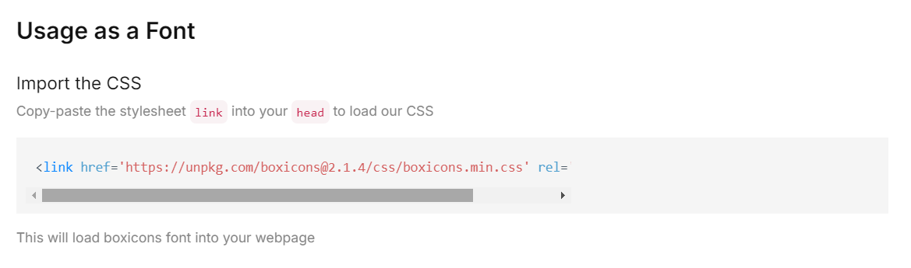
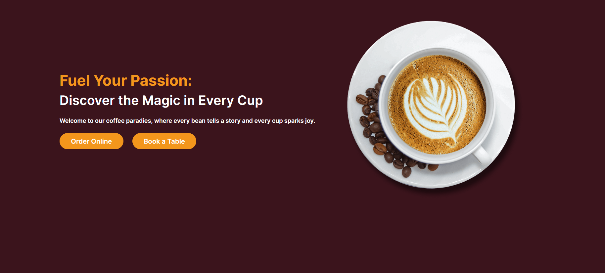
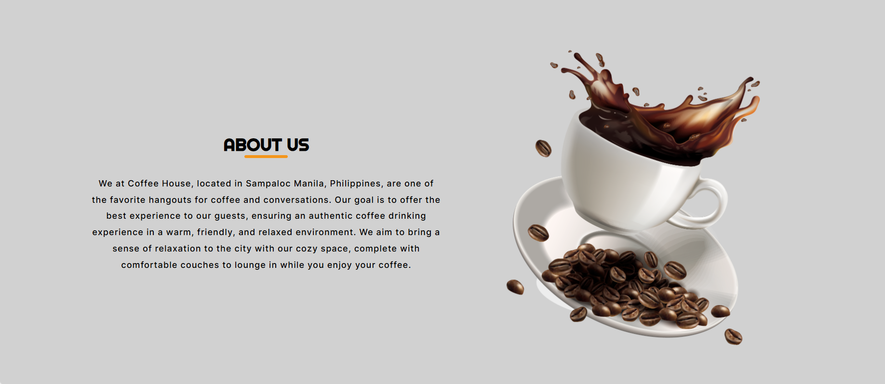
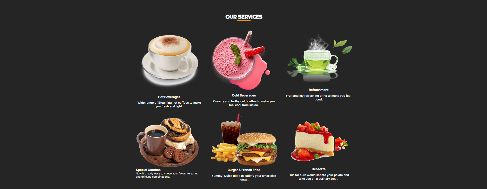
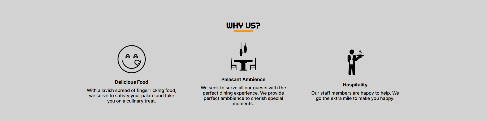
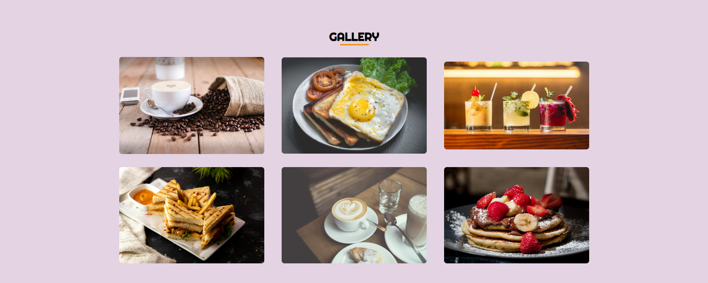
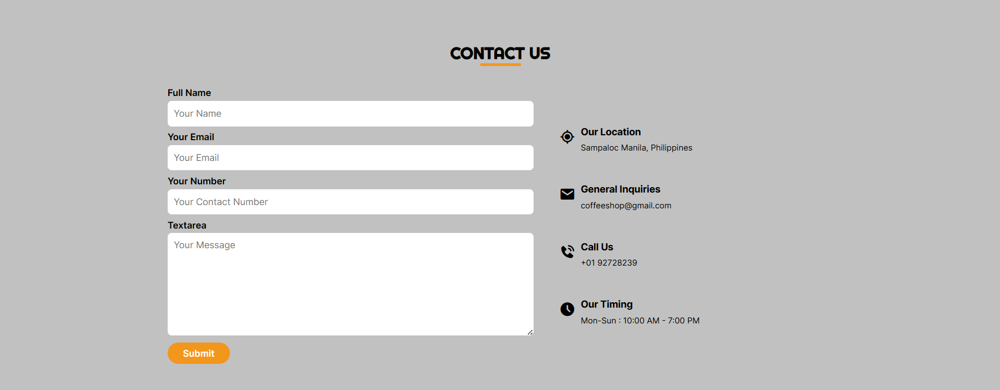

# My First Portfolio: Coffee

Here's my project I craete the web page about the Coffee Shop. Thanks to MicroCoding to teach me about "How To Create A Responsive Website Using HTML And CSS Only | HTML And CSS Website".

## The Preview

<figure>
    
</figure>

## The links needed for this page

The page we use for the icon of this project is here.

- [Boxicon](https://boxicons.com/usage)

If you want to use the icons is font in Boxicon, here's the image I provide for sample. Copy the `link` then paste it into your HTML file.

<figure>
    
</figure>

## Sections of the Web Page (Coffee Web)

### The Header

The first one is the `header` of the web page. The `header` serve as a navigator or this page. You see the menus such as Home, About, Service, etc. It is fixed. When you want to scroll from top to bottom of this project, the header still here.

<figure>
    
</figure>

### First Section

The first section is the introductory of the webpage. It helps to advertise the project as the front page of the project. Sometimes it's either a motto, mantra, etc... It helps to user if they want to buy online or book a table for the user or customer.

<figure>
    
</figure>

### Second Section

In this section, to getting to know the company information and sometimes it is the short history of the company. In this scenario, the information of the company such as the place where they located, and also how they serve the customer in their unique way.

<figure>
    
</figure>

### Third Section

In this section is to offter to the customer what they want to eat or drinks when they access your website. Example, if the user wants to order the dessert, coffee, burgers and fries, and many more.

<figure>
    
</figure>

### Fourth Section

To introduce the costumer why they want to serve to the customer as a part of to build a trust to the customers as a market strategy.

<figure>
    
</figure>

### Fifth Section

In this sections, you see the gallery of the food availability in this Cafe.

<figure>
    
</figure>

### Sixth Section

In this section is for the contacting the company directly. If the user have concern about the food, suggestion or unexpected problem of the food, here's the uses type its information to the company.

<figure>
    
</figure>

### The Last Section (Footer)

In this last section (footer). Here is the important contacts via phone, email and the schedule when the Cafe is open. And also, you can follow their social media account of this said restaurant.

<figure>
    
</figure>